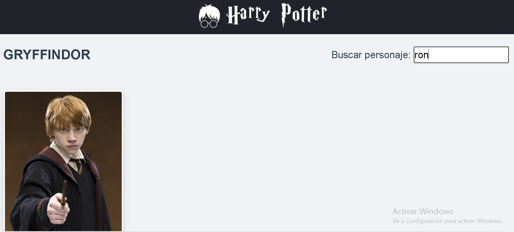

# harrypotter_app


## Configuración del proyecto

Para la instalación del proyecto se debe ejecutar:

```javascript
npm install
```

esto cargara las dependencias del proyecto. Una vez cargadas las dependencias se debe ejecutar el comando:

```javascript
npm run serve
```

de esta manera la aplicacion se abrirar en en localhost en el puerto 8080.

## Descripción de la aplicación

En el home de la aplicación podrá encontrar cada una de las casas de Harry Potter como se muestra en la figura:


cada una de las imagenes o tarjetas es clickeable, al dar click sobre una de estas te llevara a la página de la casa seleccionada con los respectivos miembros de dicha casa.


En esta parte de la aplicacion podra encontrar los miembros de la casa con su respectivo nombre y puresa de sangre. ademas puede encontrar un campo de busqueda en dodne puede filtrar un personaje por su nombre o apellido.



### Criterios de busqueda

La busqueda de los personajes se realiza por el nombre o apellido de cada uno de estos, tambien podriamos filtrar por otras propiedades de cada personaje ademas de este como se observa en el siguiente codigo en donde ademas del nombre filtramos tambien por su pureza de sangre ()

```javascript
 function(val, oldVal) {
                this.filtered=this.members.filter(member=>
                    member.name.toUpperCase().includes(this.search.toUpperCase())
                    //incluir los demas criterios de busqueda aqui
                    //por ejemplo para filtrar tambien por blood
                    || member.ancestry.includes(this.search))
                }


```
